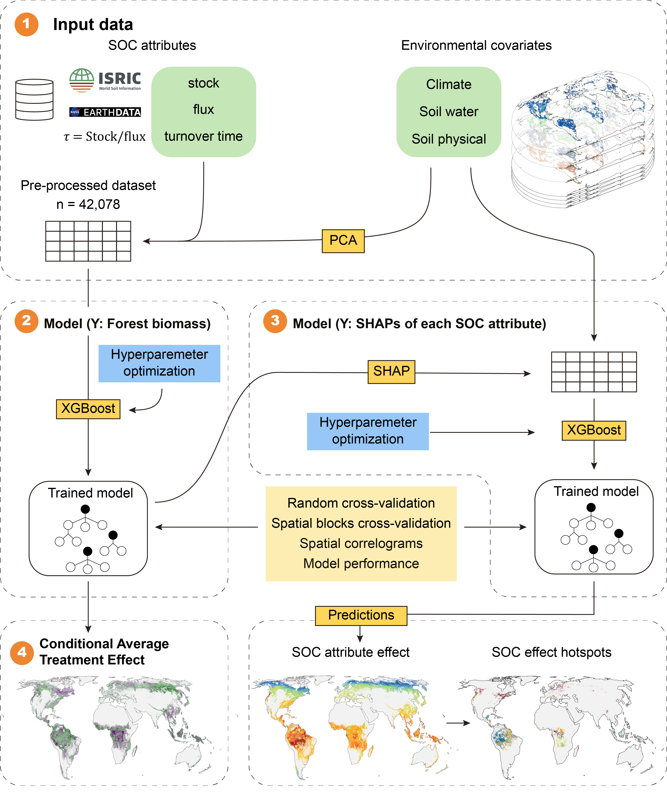

# Forest-SOC-Biomass

This repository contains the code used for the analysis in the paper: Chen et al. 2026. Soil organic carbon flux is a more critical driver of global forest biomass than carbon stock.

We developed an integrative analytical framework to disentangle the influence of SOC stock from its dynamic attributes (flux and turnover time) on forest biomass globally. Using a compiled global dataset of 41,899 forest soil profiles, we derived three SOC attributes (stock, flux, and turnover time) standardized to a 0–1 m depth interval.

Based on Extreme gradient boosting (XGBoost) algorithm and Shapley Additive Explanations (SHAP) to decompose predictions into the contributions of each SOC attribute and environmental covariates, thereby quantifying their respective controls on forest biomass across global environmental gradients. Based on this, we delineated SOC “hotspots” where specific attributes exert disproportionately strong control on biomass, providing the first spatially explicit global view of the functional geography of soil–vegetation coupling.
  
## Workflow

## Description
- figure: The folder contains main figures.
- geotiff: The folder contains GeoTIFF files of the 33 environmental covariates used in the modeling.
- input: The folder contains CSV files of 41,899 observations after preprocessing and PCA analysis, including forest biomass, SOC attributes (flux, stock, and turnover time), and 9 principal components.
- output: GeoTIFF files of SHAP values for three SOC attributes (flux, stock, and turnover time) and CATE values for flux and stock at 1 km resolution. Due to file size limitations, the files are archived on [Zenodo](https://doi.org/10.5281/zenodo.18895749).
  
- 2_model_get_shap_of_soc.R: A series of XGBoost models trained on the 9 principal components and three SOC attributes using the R package ‘caret’. Then computed SHAP values for each observation and each SOC attribute.
- 3_model_soc_effect.R: A series of XGBoost models of three SHAP values for SOC flux, SOC stock, and SOC turnover time.
- 3_predict_soc_effect.R: 100 bootstrap samples of the training data to create a confidence interval around the prediction mean of each pixel.
- 4_causal_forest.R: To quantify the spatially heterogeneous impacts of SOC stock and flux on forest biomass, we estimated the Conditional Average Treatment Effect (CATE) using the causal forest algorithm implemented in the ‘grf’ R package.

## License
The code and data shared in this study by [Zihao Chen](https://ecozihaochen.github.io/) are licensed under [CC BY-NC 4.0](https://creativecommons.org/licenses/by-nc/4.0/?ref=chooser-v1).
